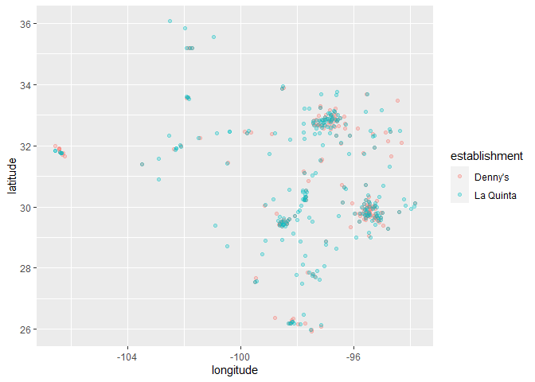

Lab 04 - La Quinta is Spanish for next to Denny’s, Pt. 1
================
Adam Paul
2/11

### Load packages and data

``` r
library(tidyverse) 
```

``` r
states <- read_csv("data/states.csv")
load("data/dennys.rda")
load("data/laquinta.rda")
```

> Getting this to work took a lot longer than I wanted to, until I
> finally realized the problem was that I hadn’t called the data within
> my markdown. It was running but not knitting.

### Exercise 1

*1. What are the dimensions of the `Denny’s` dataset? (Hint: Use inline
R code and functions like `nrow` and `ncol` to compose your answer.)
What does each row in the dataset represent? What are the variables?*

``` r
glimpse(dennys)
```

    ## Rows: 1,643
    ## Columns: 6
    ## $ address   <chr> "2900 Denali", "3850 Debarr Road", "1929 Airport Way", "230 ~
    ## $ city      <chr> "Anchorage", "Anchorage", "Fairbanks", "Auburn", "Birmingham~
    ## $ state     <chr> "AK", "AK", "AK", "AL", "AL", "AL", "AL", "AL", "AL", "AL", ~
    ## $ zip       <chr> "99503", "99508", "99701", "36849", "35207", "35294", "35056~
    ## $ longitude <dbl> -149.8767, -149.8090, -147.7600, -85.4681, -86.8317, -86.803~
    ## $ latitude  <dbl> 61.1953, 61.2097, 64.8366, 32.6033, 33.5615, 33.5007, 34.206~

There are 1,643 rows, which are each an entry of denny’s locations.
There are six columns, indicating “address”, “city”, “state”,
“zip-code”, “longitude”, and “latitude.”

*2. What are the dimensions of the La Quinta’s dataset? What does each
row in the dataset represent? What are the variables?*

``` r
glimpse(laquinta)
```

    ## Rows: 909
    ## Columns: 6
    ## $ address   <chr> "793 W. Bel Air Avenue", "3018 CatClaw Dr", "3501 West Lake ~
    ## $ city      <chr> "\nAberdeen", "\nAbilene", "\nAbilene", "\nAcworth", "\nAda"~
    ## $ state     <chr> "MD", "TX", "TX", "GA", "OK", "TX", "AG", "TX", "NM", "NM", ~
    ## $ zip       <chr> "21001", "79606", "79601", "30102", "74820", "75254", "20345~
    ## $ longitude <dbl> -76.18846, -99.77877, -99.72269, -84.65609, -96.63652, -96.8~
    ## $ latitude  <dbl> 39.52322, 32.41349, 32.49136, 34.08204, 34.78180, 32.95164, ~

There are 909 rows, indicating each listed La Quinta and its associated
variable responses. There are six columns, all the same as Denny’s;
indicating “address”, “city”, “state”, “zip-code”, “longitude”, and
“latitude.”

We would like to limit our analysis to Denny’s and La Quinta locations
in the United States.

*3. Take a look at the websites that the data come from. Are there any
La Quinta’s locations outside of the US? If so, which countries? What
about Denny’s?*

There are both La Quinta’s in Mexico, Canada, China, New Zealand,
Honduras, Turkey, UAE, Chile, and Columbia.

There are actually Denny’s in Canada, Mexico, Costa Rica, Chile,
Honduras, El Salvador, the United Kingdom, New Zealand, according to
Google.

*4. Now take a look at the data. What would be some ways of determining
whether or not either establishment has any locations outside the US
using just the data (and not the websites). Don’t worry about whether
you know how to implement this, just brainstorm some ideas. Write down
at least one as your answer, but you’re welcomed to write down a few
options too.*

One way would be to look for `state` responses that are not U.S. states,
likely returning as NA. Alternatively, if you hated your free time, you
could do the same by accounting for all possible U.S. Zip codes.
Likewise, if you hated your free time even more you could account for
the borders of the U.S. by `latitude` and `longitude` and look for
responses that fail to fall within those criteria.

*5. Find the Denny’s locations that are outside the US, if any. To do
so, filter the Denny’s locations for observations where `state` is not
in `states$abbreviation`. The code for this is given below. Note that
the `%in%` operator matches the states listed in the state variable to
those listed in `states$abbreviation`. The `!` operator means not. Are
there any Denny’s locations outside the US?*

``` r
dennys %>%
  filter(!(state %in% states$abbreviation))
```

    ## # A tibble: 0 x 6
    ## # ... with 6 variables: address <chr>, city <chr>, state <chr>, zip <chr>,
    ## #   longitude <dbl>, latitude <dbl>

This turned up no Denny’s outside the U.S.

*6. Add a country variable to the Denny’s dataset and set all
observations equal to `"United States"`. Remember, you can use the
`mutate` function for adding a variable. Make sure to save the result of
this as dennys again so that the stored data frame contains the new
variable going forward.*

``` r
dennys <- dennys %>%
  mutate(country = "United States")
```

*7. Find the La Quinta locations that are outside the US, and figure out
which country they are in. This might require some googling. Take notes,
you will need to use this information in the next exercise.*

``` r
laquinta %>%
  filter(!(state %in% states$abbreviation)) %>%
    view()
```

There are 11 in Mexico, 2 in Canada, and 1 in Colombia.

*8. Add a country variable to the La Quinta dataset. Use the case\_when
function to populate this variable. You’ll need to refer to your notes
from Exercise 7 about which country the non-US locations are in.*

``` r
laquinta <- laquinta %>%
  mutate(country = case_when(
    state %in% state.abb ~ "United States",
    state %in% c("ON", "BC") ~ "Canada",
    state == "ANT"           ~ "Colombia",
    state %in% c("AG", "QR", "CH", "NL", "VE", "PU", "SL", "FM") ~ "Mexico"
  ))
```

Going forward we will work with the data from the `United States` only.
All Denny’s locations are in the United States, so we don’t need to
worry about them. However we do need to filter the La Quinta dataset for
locations in United States.

``` r
laquinta <- laquinta %>%
  filter(country == "United States")
```

*9. Which states have the most and fewest Denny’s locations? What about
La Quinta? Is this surprising? Why or why not?*

``` r
sort(table(dennys$state))
```

    ## 
    ##  DE  DC  VT  AK  IA  NH  SD  WV  LA  MT  ND  WY  MS  NE  RI  HI  AL  ME  TN  KS 
    ##   1   2   2   3   3   3   3   3   4   4   4   4   5   5   5   6   7   7   7   8 
    ##  MA  AR  NJ  ID  CT  MN  OK  KY  SC  GA  MI  OR  WI  MD  UT  NC  NM  VA  CO  NV 
    ##   8   9  10  11  12  15  15  16  17  22  22  24  25  26  27  28  28  28  29  35 
    ##  IN  PA  MO  OH  WA  IL  NY  AZ  FL  TX  CA 
    ##  37  40  42  44  49  56  56  83 140 200 403

``` r
sort(table(laquinta$state))
```

    ## 
    ##  ME  AK  NH  RI  SD  VT  WV  WY  IA  MI  ND  NE  NJ  CT  MA  MN  NV  SC  KS  MT 
    ##   1   2   2   2   2   2   3   3   4   4   5   5   5   6   6   7   8   8   9   9 
    ##  ID  KY  OR  PA  MO  MS  NC  UT  AR  MD  WI  VA  AL  WA  IL  IN  OH  AZ  NM  NY 
    ##  10  10  10  10  12  12  12  12  13  13  13  14  16  16  17  17  17  18  19  19 
    ##  CO  LA  OK  TN  GA  CA  FL  TX 
    ##  27  28  29  30  41  56  74 237

The state with the most Denny’s is California with 403, and the least is
Delaware with 1.

The state with the most La Quinta locations is Texas with 237, and the
least is Maine with one.

Neither of these is surprising, as Denny’s started on the west coast and
La Quinta is part of a megacorporation that would use their different
names based on location, and a Spanish name makes the most sense in
Texas. Also, they started in Texas.

*10. Which states have the most Denny’s locations per thousand square
miles? What about La Quinta?*

``` r
dennys %>%
  count(state) %>%
  inner_join(states, by = c("state" = "abbreviation")) %>%
  mutate(dennys_per_sq= 1000*area/n) %>%
  arrange(dennys_per_sq)
```

    ## # A tibble: 51 x 5
    ##    state     n name                     area dennys_per_sq
    ##    <chr> <int> <chr>                   <dbl>         <dbl>
    ##  1 DC        2 District of Columbia     68.3        34170 
    ##  2 RI        5 Rhode Island           1545.        308978 
    ##  3 CA      403 California           163695.        406190.
    ##  4 CT       12 Connecticut            5543.        461951.
    ##  5 FL      140 Florida               65758.        469698.
    ##  6 MD       26 Maryland              12406.        477151.
    ##  7 NJ       10 New Jersey             8723.        872258 
    ##  8 NY       56 New York              54555.        974196.
    ##  9 IN       37 Indiana               36420.        984312.
    ## 10 OH       44 Ohio                  44826.       1018763.
    ## # ... with 41 more rows

The state with the most Denny’s per 1000 square miles is Rhode Island,
as the District of Columbia is not a state.

``` r
laquinta %>%
  count(state) %>%
  inner_join(states, by = c("state" = "abbreviation")) %>%
  mutate(laquinta_per_sq= 1000*area/n) %>%
  arrange(laquinta_per_sq)
```

    ## # A tibble: 48 x 5
    ##    state     n name             area laquinta_per_sq
    ##    <chr> <int> <chr>           <dbl>           <dbl>
    ##  1 RI        2 Rhode Island    1545.         772445 
    ##  2 FL       74 Florida        65758.         888618.
    ##  3 CT        6 Connecticut     5543.         923902.
    ##  4 MD       13 Maryland       12406.         954302.
    ##  5 TX      237 Texas         268596.        1133318.
    ##  6 TN       30 Tennessee      42144.        1404808.
    ##  7 GA       41 Georgia        59425.        1449394.
    ##  8 NJ        5 New Jersey      8723.        1744516 
    ##  9 MA        6 Massachusetts  10554.        1759065 
    ## 10 LA       28 Louisiana      52378.        1870648.
    ## # ... with 38 more rows

The state with the most La Quinta’s per square mile is also Rhode
Island.

Next, we put the two datasets together into a single data frame. However
before we do so, we need to add an identifier variable. We’ll call this
`establishment` and set the value to “Denny’s” and “La Quinta” for the
`dennys` and `laquinta` data frames, respectively.

``` r
dennys <- dennys %>%
  mutate(establishment = "Denny's")
laquinta <- laquinta %>%
  mutate(establishment = "La Quinta")
```

Because the two data frames have the same columns, we can easily bind
them with the bind\_rows function:

``` r
dennys_laquinta <- bind_rows(dennys, laquinta)
```

``` r
ggplot(dennys_laquinta, mapping = aes(x = longitude, y = latitude, color = establishment)) +
  geom_point()
```

<!-- -->

*11. Filter the data for observations in North Carolina only, and
recreate the plot. You should also adjust the transparency of the
points, by setting the `alpha` level, so that it’s easier to see the
overplotted ones. Visually, does Mitch Hedberg’s joke appear to hold
here?*

### Code not working :(

I really wanted to try and subset within my graph, but despite following
the guides I found it’s not working. So I’m leaving this code to be
analyzed by you, to find what’s wrong, and going about it a different
way below.

``` r
ggplot(subset(dennys_laquinta, state %in% "NC", 
      aes(x = longitude, y = latitude, color = establishment))) +
  geom_point() +
  labs(title = "Denny's and La Quinta locations in NC",
       subtitle = "Locations in North Carolina of both chains",
       x = "Longitude", y= "Latitude")
```

### Code that works

``` r
dennys_laquinta_NC <- dennys_laquinta %>%
  filter(state == "NC")
ggplot(dennys_laquinta_NC, 
       aes(x = longitude, y = latitude, color = establishment)) +
  geom_point(alpha=0.5)
```

<!-- -->

It does not look to be true that there are frequently Denny’s and La
Quinta’s right next to one another in North Carolina.

*12. Now filter the data for observations in Texas only, and recreate
the plot, with an appropriate \``alpha` level. Visually, does Mitch
Hedberg’s joke appear to hold here?*

``` r
dennys_laquinta_TX <- dennys_laquinta %>%
  filter(state == "TX")
ggplot(dennys_laquinta_TX, 
       aes(x = longitude, y = latitude, color = establishment)) +
  geom_point(alpha=0.3)
```

<!-- -->

While it is more true in Texas, they are also heavily centered around
the state’s major cities, so I don’t know if I’m convinced. But, it is
technically true they hover with one another across the state.
